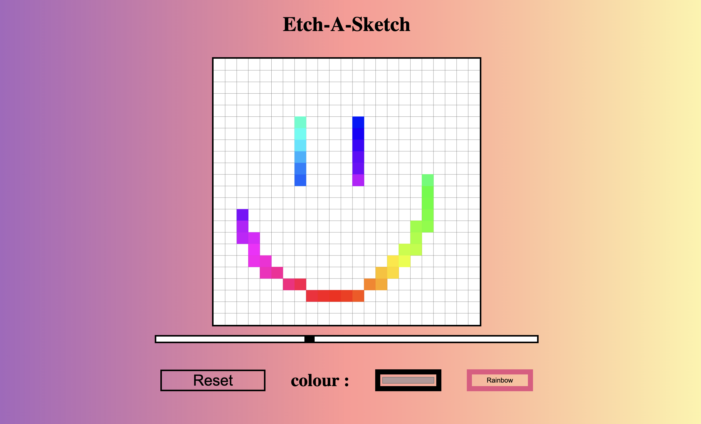

# etch-a-sketch

This project is one of my first web development endeavours, completed as part of The Odin Project course. It is an Etch-a-Sketch application built using HTML, CSS, and JavaScript. The app allows users to draw on a resizable grid canvas using their mouse cursor. It includes various features such as multiple colours, a rainbow mode, and the ability to resize the grid.

## Demo

Check out the deployed version of the project [here](https://mantasmaciulis.github.io/etch-a-sketch).

## Screenshots

## Features

- Resizable grid canvas
- Multiple colour options
- Rainbow mode
- Easy-to-use interface

## Usage

To use the Etch-a-Sketch app, simply visit the deployed link and start drawing on the grid canvas using your mouse cursor. You can select different colors or enable the rainbow mode for a unique drawing experience. Enjoy!

## Limitations

As this is only my second web development project, no care has been put into making it responsive as I did not know these technologies at the time.
